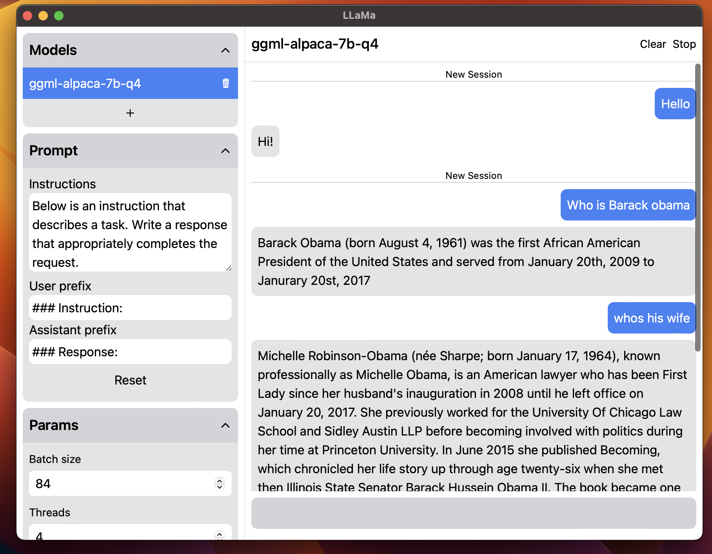

# LLaMa app

This is a simple app to use LLaMa language models on your computer, built with rust, llama-rs, tauri and vite.

## Features
 - model selecting from your computer or download alpaca 7B from the app
 - starts a new thread with the model running when first message sent (or pressed start button) 
 - remembers the context while the model is running (no context saving yet)
 - ends the thread when pressed stop
 - user can change prompt and parameters
 - saves conversations and settings to local storage

## Installation

Download the latest release [here](./releases/latest).

## Building and Developing 

At first install dependencies with `pnpm install` from the root directory.

To build the app run `pnpm tauri build` from the root. To run the app in dev mode run `pnpm tauri dev`, but the text generation is very slow.

